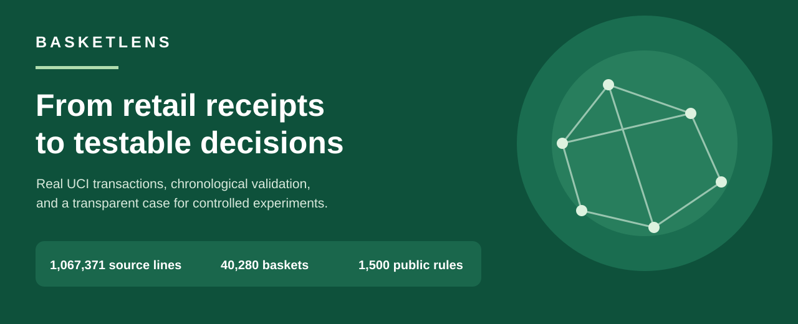

# BasketLens

**Retail market basket intelligence | Independent Data Analyst portfolio project**

[**View the Vercel portfolio site**](https://basketlens-fadhil-9768s-projects.vercel.app/) · [**Inspect the Streamlit implementation**](https://github.com/Fadhilstat/BasketLens/blob/main/app/streamlit_app.py) · [**Read the consulting case study**](docs/portfolio-case-study.md) · [**Review the methodology**](docs/methodology.md) · [**Publication kit**](docs/publication-readiness.md) · [**Inspect CI**](https://gitlab.com/fadhilrusydih/basketlens/-/pipelines)

BasketLens turns UCI Online Retail II receipts into auditable product-pair associations and tests whether those patterns appear again in later invoices. Its most important output is a **shortlist of testable retail hypotheses**, not a prediction of incremental revenue.

> **Evidence boundary:** support, confidence and lift describe historical co-occurrence. They do not establish the causal impact of bundling or product placement.

## At a glance

| Measure | Verified result |
| --- | ---: |
| Original source lines | **1,067,371** |
| Routine exclusions | **30,317** |
| Additional source lines quarantined | **5,773**, across 83 conflicting invoices |
| Eligible analysis lines | **1,031,281** |
| Valid invoice baskets | **40,280** |
| Earlier training baskets | **32,224** |
| Later holdout baskets | **8,056** |
| Full FP-Growth rule candidates | **113,001** |
| Curated training-selected rules in the public exhibit | **1,500** |

These counts come from the checksum-verified, aggregate-only public exhibit generated from the official UCI workbook. A separate sparse **pairwise** baseline is used for numerical cross-checks. Do not confuse its smaller rule count with the full FP-Growth total.

## One real business example

**Pink Polkadot Jumbo Bag (22386) → Red Retrospot Jumbo Bag (85099B)**

- Earlier baskets containing both products: **1,166**
- Training confidence: **63.1%**, lift: **6.24x**
- Later baskets containing Pink Polkadot: **416**
- Later baskets containing both: **279**
- Later confidence: **67.1%**, lift: **6.77x**

The example is selected with training-period evidence before the later outcomes are inspected. Its recurrence makes it worth **considering for a controlled placement or bundling test**, assuming inventory and contribution margins are acceptable. No uplift, profit, or modern retail relevance has been demonstrated.

The application also generates this decision brief dynamically from validated rule and holdout tables, so the display stays consistent with the selected research build.

## What the dashboard lets you do

| Screen | Why it matters |
| --- | --- |
| **Sales overview** | See eligible merchandise activity, basket composition, historical product ranking, and a concrete analyst decision brief. |
| **Association explorer** | Search products and SKUs, filter by confidence evidence and lift, inspect interpretable pair cards, access the filtered rule table and optional network. |
| **Build a basket** | Construct an example set of products and explore later-period evidence-ranked candidates with CSV export. |
| **Data quality & methodology** | Inspect exclusions, invoice quarantine, chronological validation, source scope, and analytical limitations. |

The public Streamlit app uses a **checksum-verified aggregate-only exhibit**. Raw source workbooks, customer IDs, invoice IDs and transaction-level records are not published. Public hosted access should be checked from an anonymous browser before social promotion.

## Portfolio frontend for Vercel (M6.3)

The `site/` folder provides a separate, recruiter-first portfolio dossier with responsive editorial design, an accessible train/holdout comparison, and links to the complete Streamlit research workbench. The dossier is a **read-only explanatory companion**. It does not replace Python mining, load raw customer information, or claim conversion or revenue uplift.

To test it locally: `npm --prefix site test` and `npm --prefix site run build`. The prebuilt `site/dist/` directory can be deployed as a static Vercel project with **Root Directory = site**. Vercel production is deployed from GitLab `main` to [BasketLens portfolio](https://basketlens-fadhil-9768s-projects.vercel.app/) (deployment `dpl_33yyNrDmzfaFU7jJfMg7m91GbbTG`, status READY). Anonymous access PASSED an external Chromium guest check on 2026-10-10 (HTTP 200, desktop 1440 px, mobile 390 px, and narrow mobile 320 px; tabs, keyboard, and overflow). [View verified CI evidence](https://gitlab.com/fadhilrusydih/basketlens/-/jobs/17080255194). The separate Streamlit workbench retains its own access/interaction gate. See [Vercel frontend contract](docs/vercel-frontend.md).

## Reproducible architecture

~~~text
Official UCI Online Retail II XLSX
   -> schema adapter and source lineage
   -> line-quality exclusions + invoice conflict audit
   -> 40,280 distinct eligible invoice baskets
   -> chronological train / holdout split
   -> sparse pairwise baseline + FP-Growth
   -> later confidence, lift and uncertainty diagnostics
   -> independently verified artifact bundle
   -> aggregate-only, SHA-256-checked public exhibit
   -> Streamlit decision brief and research dashboard
~~~

**Core stack:** Python, Pandas, NumPy, SciPy, mlxtend, Plotly, Streamlit, Pytest, Chromium/Playwright, GitLab CI and GitHub Actions.

## Run locally

Python 3.11 is recommended.

~~~bash
python -m venv .venv
source .venv/bin/activate
python -m pip install -e '.[dev]'
python -m basketlens.cli doctor
python -m basketlens.cli download
python scripts/source_conflict_audit.py --max-loss-fraction 0.01 --report reports
python -m basketlens.cli build --algorithm fpgrowth --inconsistent-policy quarantine
python -m basketlens.cli verify
streamlit run app/streamlit_app.py
~~~

On Windows, activate the virtual environment with .venv\Scripts\Activate.ps1. For local use without the full downloaded dataset, the published aggregate-only exhibit is automatically loaded when the processed directory is absent.

The code defaults to **fail closed** when source invoices have contradictory timestamps or countries. The quarantine mode above is explicit and should only be enabled after inspecting the conflict report.

### Tests

~~~bash
python -m compileall -q src app scripts
python -m pytest -q
python scripts/check_public_demo.py
python -m pip check
~~~

GitHub Actions runs source compilation, unit tests, dependency checks and public-exhibit verification. GitLab merge-request CI additionally downloads the full official dataset, checks conflict policy, runs pairwise and FP-Growth validations, checks aggregate exhibit parity and executes real Streamlit browser tests in desktop/mobile viewports. Review actual successful pipeline results instead of treating CI configuration as proof.

## Limitations and next step

- These are **2009–2011** historical transactions and may not generalise to today's products or customer mix.
- Positive merchandise values are not net revenue or profit after returns.
- The source does not include inventory, margin, promotion costs or experimental product exposure.
- Repeated customer behaviour can affect uncertainty estimates. Many association rules are screened without formal multiplicity adjustment.
- Temporal holdout can demonstrate descriptive repeat co-occurrence. **A randomized test** is needed to estimate incremental sales, conversion or margin.

**Proposed next experiment:** test adjacent display of the two bags for a defined eligible audience. Pre-register the primary outcome, power/sample size and guardrail metrics. Measure completed sales and contribution margin against a control after inventory checks.

## Project documentation

- [Consulting case study](docs/portfolio-case-study.md)
- [Research methodology](docs/methodology.md)
- [Validation protocol](docs/verification.md)
- [Product experience and accessibility](docs/experience.md)
- [Public exhibit format and privacy](data/public_demo/README.md)

## Source, license and author

Dataset: Chen, D. (2019), **Online Retail II**, UCI Machine Learning Repository, [DOI 10.24432/C5CG6D](https://doi.org/10.24432/C5CG6D), **CC BY 4.0**. The original dataset must be attributed, and raw data is not redistributed in this repo.

Application code: [MIT](LICENSE).

**Fadhil Rusydi Hafizh** · [GitHub](https://github.com/Fadhilstat) · [LinkedIn](https://www.linkedin.com/in/fadhilrusydi31/)

## Sharing this portfolio

The M6.2 release package contains exactly three consulting slides as 1920 x 1080 PNG files, an editable PowerPoint and a caption ready for review. These binary publication assets are delivered separately rather than checked into the source repo. See the [three-slide narrative](docs/social/three-slide-story.md), [LinkedIn post](docs/social/linkedin-post.md) and [publication readiness checklist](docs/publication-readiness.md).

The application has passed source CI and simulated public-data browser QA. **This is not proof of anonymous Streamlit Community Cloud access.** Verify the hosted app in a logged-out incognito window before sharing it.

**Hosted workbench limitation (2026-10-10):** the separate Streamlit URL did not load the required dashboard content for a fresh anonymous visitor on desktop or mobile (GitLab probe [17080255195](https://gitlab.com/fadhilrusydih/basketlens/-/jobs/17080255195)). The cause is not yet established; do not promise this hosted deep dive to public viewers. The audited Python source, data contracts and methodology remain reproducible from the repository. The public Vercel dossier passed independent guest QA.
